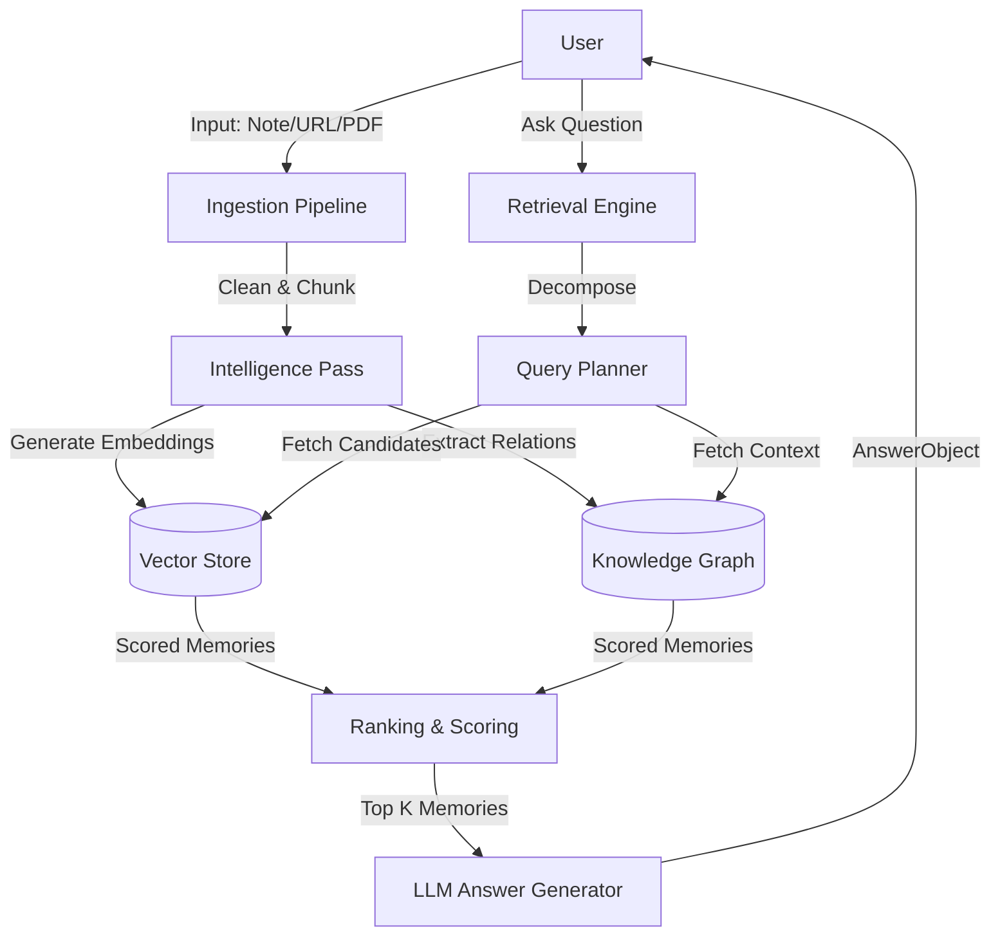
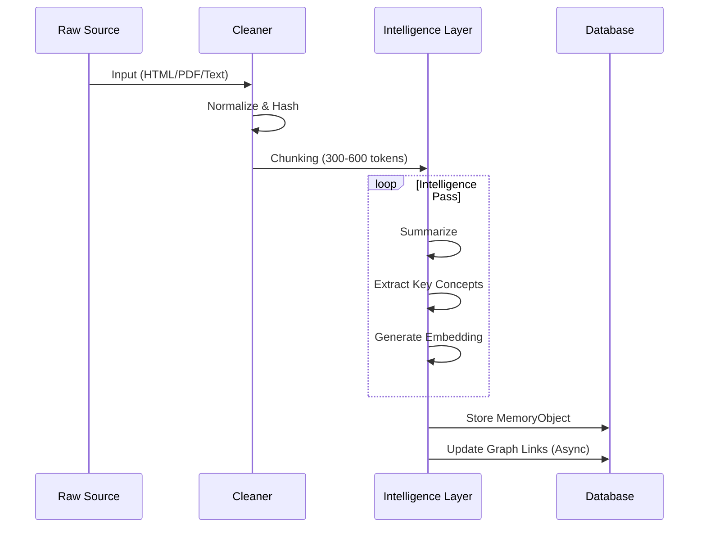

# 🪐 Antigravity — Personal Cognitive Memory System (PCMS)
## **COMPLETE UNIFIED MASTER SPECIFICATION**

> **Status:** 🔒 MASTER SPEC (Ready for Implementation)
> **Purpose:** Lock in the immutable core of the product before UI polish, features, or scaling.
> Everything here is part of the “Antigravity layer” — do **not change** lightly.

---

## **PART 1: PRODUCT CORE & PHILOSOPHY**

### **1.1 Product Identity**
- **Category:** Personal Cognitive Memory System (PCMS)
- **Promise:** “Ask anything you’ve ever learned — and get answers grounded in your real past.”
- **Hook:** Trust, personal memory, habit-forming recall.
- **North Star Metric:** Trust Score (User verification rate of retrieved memories).

### **1.2 Design Philosophy (Non-Negotiable)**
1.  **Calm intelligence beats excitement**
2.  **Motion explains, never decorates**
3.  **Whitespace is a feature**
4.  **Nothing should feel “busy”**
5.  **The product should feel expensive, quiet, and inevitable**

**Inspiration:** Linear, Arc, Stripe, Vercel. **Not** productivity tools or AI toys.

### **1.3 Product Voice & Microcopy (Locked)**
> **Goal:** Make the system feel alive, personal, and trustworthy.

#### **Core Voice Principles**
1.  **Personal, not AI-like**: “Your notes show…” instead of “According to sources…”
2.  **Calm and honest**: Admit gaps. Never overconfident.
3.  **Curious and suggestive**: Offer follow-ups. Ask questions to encourage memory saving.
4.  **Short and scannable**: 1–3 sentences per paragraph. No academic tone.

---

## **PART 2: SYSTEM ARCHITECTURE & DATA MODEL**

### **2.1 Architecture Overview**

#### **High-Level Data Flow**


### **2.2 MemoryObject (Atomic Unit)**

#### **Principles**
1.  **Memory ≠ Note**: A note is a document; a memory is a discrete cognitive unit derived from it.
2.  **Traceability**: Every answer must point back to a specific `id`.
3.  **Temporal Context**: *When* you learned something is as important as *what* it is.
4.  **User Sovereignty**: User always owns the raw truth; AI is just the librarian.

#### **Schema**
```typescript
type UUID = string;

interface MemoryObject {
  id: UUID;
  user_id: UUID;

  // Content
  raw_content: string;         // The exact excerpt from source
  raw_content_hash: string;    // SHA-256 for integrity check
  cleaned_content: string;     // Strip HTML, markdown noise, etc.

  // Provenance
  source_type: 'note' | 'web' | 'pdf' | 'youtube' | 'conversation';
  source_url?: string;
  source_title?: string;
  source_author?: string;

  // Chronology
  created_at: Date;            // When this object was created in DB
  consumed_at?: Date;          // When the user actually read/watched this (User Time)
  source_published_at?: Date;  // When the content was originally published (World Time)

  // Intelligence
  summary: string;             // generated 3-5 sentence summary
  key_concepts: string[];      // ["React", "State Management", "Zustand"]
  embedding: number[];         // 1536d vector (OpenAI/Cohere)

  // Graph Connections
  related_memory_ids: UUID[];
  relationship_reason?: string[]; // e.g., ["Contradicts memory-123", "Expands on memory-456"]

  // Verification & Feedback
  confidence_score: number;    // 0.0 to 1.0 (How reliable is this source?)
  user_verified: boolean;      // Has user explicitly confirmed this?
  correction_notes?: string;   // User overrides

  // Retention Physics
  importance_weight: number;   // 0.0 to 1.0 (User defined or inferred importance)
  decay_rate: number;          // Standard decay curve modifier

  deleted_at?: Date;
}
```

#### **Ingestion Pipeline Flow**


### **2.3 AnswerObject (Output Contract)**

#### **Principles**
-   **Grounded**: No hallucinations. If confidence is low, admit it.
-   **Evidence-First**: Show the work. Citations are first-class citizens.
-   **Tone**: Calm, human, objective.

#### **Schema**
```typescript
interface AnswerObject {
  id: UUID;
  user_id: UUID;

  // Input Context
  original_query: string;
  interpreted_intent: 'overview' | 'timeline' | 'summary' | 'comparison' | 'unknown';

  // The Output
  answer_text: string; // Markdown supported

  // Making it verifiable
  supporting_memories: {
    memory_id: UUID;
    source_title?: string;
    source_type: string;
    consumed_at?: Date;
    confidence_score: number;
    relevance_score: number; // The logic score that picked this memory
    snippet: string;         // The specific part used
  }[];

  // Meta-Cognition
  overall_confidence: number;
  uncertainty_notes?: string; // "I found standard docs, but no personal notes on this."

  // Temporal Reasoning (if timeline intent)
  timeline?: {
    memory_id: UUID;
    date: Date;
    role: 'first_encounter' | 'refinement' | 'contradiction';
    description: string;
  }[];

  // Next Steps
  suggested_actions: {
    label: string;
    action_type: 'expand' | 'summarize' | 'open_source' | 'compare';
    payload?: any;
  }[];

  generated_at: Date;
}
```

### **2.4 Retrieval Engine (The "Brain")**
Prioritizes **context** over simple keyword matching.

#### **Scoring Algorithm**
Final relevance score for a memory candidate is a weighted sum:
`Score_final = (S_sem × 0.40) + (S_temp × 0.20) + (S_imp × 0.15) + (S_graph × 0.15) + (S_conf × 0.10)`

| Component | Weight | Description |
| :--- | :--- | :--- |
| **Semantic (S_sem)** | 40% | Cosine similarity of vector embeddings. |
| **Temporal (S_temp)** | 20% | Recency bias OR foundation bias (depending on intent). |
| **Importance (S_imp)** | 15% | Explicit user weight + derived importance (e.g., heavily linked). |
| **Graph (S_graph)** | 15% | Boosts memories linked to currently high-scoring memories (spreading activation). |
| **Confidence (S_conf)** | 10% | Penalizes low-quality or hallucinated sources. |

#### **Intent-Sensitive Modifiers**
-   **Intent: Timeline**: Flip `S_temp` to favor older "foundational" memories and distribution over time.
-   **Intent: Summary**: Boost `S_imp` to capture high-level concepts, reduce noise.

### **2.5 WOW Queries (Acceptance Tests)**
Define the "magic moment" for the user.
1.  **“What do I know about X?”** - *Goal:* Broad semantic search, high recall, structured overview.
2.  **“When did I first learn about X, and how has my view changed?”** - *Goal:* Identify `first_encounter`, detect semantic drift/contradiction.
3.  **“Summarize everything I’ve learned about X in simple terms.”** - *Goal:* Aggressive compression, synthesis without hallucination.

---

## **PART 3: TECHNOLOGY & SECURITY**

### **3.1 Tech Stack (LOCKED)**
> **Status:** ✅ LOCKED. Choices support stability, type safety, and graph/vector hybrid storage.

#### **Data Persistence (The "Hippocampus")**
*   **Primary Database:** **PostgreSQL** (via Supabase or self-hosted).
    *   *Why:* Single ACID-compliant store for relational structured data (`MemoryObject`) and vector data.
*   **Vector Engine:** **pgvector**.
    *   *Why:* Zero-latency joins between embeddings and metadata. No separate vector DB sync issues.
*   **ORM:** **Prisma**.
    *   *Why:* User preference, strong type safety, and ecosystem maturity. Will use PostgreSQL extensions for vector operations.

#### **Intelligence & Application Layer**
*   **Framework:** **Next.js 15** (App Router).
    *   *Why:* React Server Components are ideal for streaming complex AI responses.
*   **AI Orchestration:** **Vercel AI SDK (Core)**.
    *   *Why:* Clean abstractions for streaming, tool calling, and switching models (OpenAI/Anthropic) without lock-in.
*   **Language:** **TypeScript** (Strict).
    *   *Why:* End-to-end type safety matches our Schema-first approach.

### **3.2 Privacy & Sovereignty**
-   **Data Ownership:** Row Level Security (RLS) in Postgres ensures complete user isolation.
-   **Encryption:** Standard Encryption-at-Rest for DB. API Keys hashed.

### **3.3 Integration Plan**
| Module | Responsibility | Implementation Notes |
| :--- | :--- | :--- |
| **Ingestion Service** | Raw capture → cleaning → intelligence → MemoryObject storage | Python/Node script utilizing `cheerio` (web) and `pdf-parse` (PDF) |
| **Embedding Service** | Generate vector embeddings | `text-embedding-3-small` (efficient, good cost/perf) |
| **Retrieval Engine** | Candidate selection → scoring → ranking → output AnswerObject | Custom SQL function in Postgres using `pgvector` cosine distance |
| **Answer Synthesizer** | Transform retrieved memories into AnswerObject | GPT-4o or Claude 3.5 Sonnet streaming text |
| **UI/UX Layer** | Ask screen, Answer view, Timeline, Add memory | Next.js Client Components + Radix UI Primitives |
| **Habit Loop Engine** | Weekly insights, suggested actions | Cron job triggering aggregations on `created_at` |

---

## **PART 4: USER EXPERIENCE & INTERFACE**

### **4.1 Global Layout & Structure**
-   **Structure:** No traditional sidebar. Top navigation only. Content centered.
-   **Top Bar:**
    -   Left: Product wordmark.
    -   Right: Add Memory (icon + text), Timeline (icon), Profile menu (minimal).
-   **No:** notifications bell, clutter.

### **4.2 Core Screens & Flows**

#### **Screen 1: Landing Page (High-Conversion)**
**Purpose:** Instant understanding, build trust, trigger curiosity, funnel into app.

**Section 1 — Hero (Above the Fold)**
-   **Headline (H1):** `Ask anything you’ve ever learned.`
-   **Subheadline (H2):** `Your personal memory, grounded in what you’ve actually read, saved, and written — not generic answers.`
-   **Primary CTA:** `Start remembering`
-   **Secondary CTA:** `See how it works`
-   **Animation:** A single input field animates, types: `"When did I first learn about pricing psychology?"`, answer fades in with `"Based on your saved memories"` label.

**Section 2 — What It Does**
-   **Title:** `A memory that works the way you think.`
-   **Item 1:** `Save what matters — articles, notes, documents — without organizing anything.`
-   **Item 2:** `Ask questions naturally, and get answers grounded in your own past.`
-   **Item 3:** `See how your understanding evolves over time.`

**Section 3 — Trust & Differentiation**
-   **Title:** `This is not a notes app.`
-   **Copy:**
    -   `Notes store information. This remembers it.`
    -   `Search finds text. This recalls meaning.`
    -   `Generic AI answers for everyone. This answers for you.`

**Section 4 — Silent Product Demo (Scroll-triggered)**
-   **Captions (subtle):** `A memory is saved. Connections are formed. Answers stay grounded.`

**Section 5 — Final CTA**
-   **Title:** `Build a memory you can trust.`
-   **Button:** `Start now`

#### **Screen 2: Ask Screen (Home / The Heart)**
**Purpose:** Where users spend most time. Single action focus.
-   **Layout:** Vertically centered. Large input field. Everything else secondary.
-   **Input Field:** Generous height. Rounded corners. Border on focus. Placeholder: `Ask your past self anything…`
-   **Behavior:** Enter = submit, Shift+Enter = new line. On submit, input shifts up, answer fades in below (no page reload).
-   **Smart Suggestions:** Dynamic prompts based on history (subtle, low contrast).

#### **Screen 3: Answer View (Embedded)**
**Purpose:** Display grounded, trustworthy answers.
**Structure (Top-Down):**
1.  **Synthesized Answer:** Comfortable line length, calm typography.
2.  **Confidence Indicator:** Small dot + label (`High/Moderate/Limited confidence`).
3.  **Evidence Section:** Collapsed by default. Label: `Based on your saved memories`.
4.  **Memory Cards (Expandable):**
    -   Collapsed: Source title, date, confidence dot.
    -   Expanded: Summary, raw content (scrollable).
5.  **Suggested Actions:** Inline buttons (`Ask follow-up`, `Revisit source`, `Summarize`).

#### **Screen 4: Memory Timeline**
**Purpose:** Reflection, trust, emotional attachment. Visualize knowledge growth.
-   **Layout:** Vertical timeline of `MemoryObject` nodes, chronological.
-   **Entry:** Date, event label (First encounter, Reinforcement...), source title.
-   **Interaction:** Click to expand inline (summary, source, confidence). Button: `Ask about this`.

#### **Screen 5: Add Memory Flow**
**Purpose:** Effortless capture.
-   **Trigger:** Top bar button or contextual prompts.
-   **Modal Title:** `Add something your future self should remember`
-   **Input Options (Stacked):** Paste text, Paste link, Upload file.
-   **Behavior:** No advanced options. On save, subtle confirmation, modal closes, memory immediately usable.

### **4.3 Component Breakdown (Frontend-Ready)**
-   **`AppShell`:** Centers content, max-width, responsive padding.
-   **`TopNav`:** Logo, Add Memory, Timeline, Profile.
-   **`AskInput`:** Auto-focus, Enter submit, Shift+Enter new line, animates on submit.
-   **`AnswerBlock`:** Composes answer text, confidence, evidence, actions.
-   **`ConfidenceIndicator`:** Dot + label (high/moderate/limited).
-   **`EvidenceAccordion`:** Collapsed by default, smooth height animation, contains `MemoryCard`s.
-   **`MemoryCard`:** Expandable inline. Shows title, source, date, confidence, summary, raw content.
-   **`TimelineView`:** Vertical list, grouped by date, expandable entries.
-   **`AddMemoryModal`:** Single submit. Paste text/link, upload file.

### **4.4 Motion & Animation Spec (Strict)**
-   **Global Rules:** Duration: **120–220ms**. Easing: `cubic-bezier(0.4, 0.0, 0.2, 1)`. Only `opacity` & `transform`. Respect `prefers-reduced-motion`.
-   **Landing Hero Demo:** Typing (1.2s), answer fade-in with slight upward translate.
-   **Ask → Answer Transition:** Input shifts up (`translateY(-24px)`), answer fades in after 80ms delay.
-   **Evidence Accordion:** Height auto-animation, cards stagger fade-in (40ms).
-   **Timeline Expand:** Inline height expansion.
-   **Modal (Add Memory):** Fade + scale (0.98→1), background dim.

### **4.5 Design Tokens (Foundation System)**
-   **Spacing Scale:** `--space-1: 4px` to `--space-8: 64px`.
-   **Typography Scale:** `--text-xs: 12px` to `--text-3xl: 36px`. Line-height: 1.4–1.6. Max line width: ~65ch.
-   **Border Radius:** `--radius-sm: 6px`, `--radius-md: 10px`, `--radius-lg: 14px`. No pills.
-   **Elevation:** Use sparingly. Prefer borders. Modals only get subtle shadow.
-   **Color Philosophy:** Neutral base. High contrast text. Accent sparingly. Confidence colors: muted green (high), amber (medium), red (low).

### **4.6 Responsive Design**
-   **Mobile:** Ask screen primary. Timeline = stacked list. Evidence cards swipe-expand. No hover.
-   **Tablet:** Same layout, more spacing.
-   **Desktop:** Max-width constraint. Content never stretches too wide.

### **4.7 Accessibility & Performance**
-   All text readable at 200% zoom.
-   Keyboard-only navigation supported.
-   Screen reader labels on all inputs.
-   Animations respect reduced-motion settings.
-   **Lighthouse score target:** 95+.

### **4.8 Microcopy Guidelines**
-   **Ask Screen Placeholder:** `Ask anything you’ve ever learned…`
-   **Ask Screen Tooltip:** `Your past self remembers everything you saved — start asking to find out.`
-   **Answer Evidence Label:** `Based on your saved memories`
-   **Answer Uncertainty:** `Your saved information is limited; this summary may not cover everything.`
-   **Add Memory Header:** `Add something you want your future self to remember`
-   **Add Memory Empty State:** `Paste text, paste a link, or upload a file. We’ll organize it for you.`
-   **Add Memory Confirmation:** `Memory saved — your past self thanks you!`
-   **Timeline Intro:** `Your memories, in the order you learned them. Explore your growth.`

---

## **PART 5: IMPLEMENTATION ROADMAP**

### **Phase 1: The Brain (Backend & Data)**
1.  Initialize Repo: Next.js + Postgres + Drizzle setup.
2.  Schema Migration: Create `memories` and `users` tables with vector columns.
3.  Ingestion Prototype: Build script (URL/Text → Clean → Embed → Save).
4.  Retrieval Logic: Implement "Scoring Algorithm" as a SQL function.

### **Phase 2: The Mouth (Intelligence)**
1.  Answer Synthesis: Connect `Retrieval Engine` to LLM to generate `AnswerObject`.
2.  Validation: Run WOW Queries via API tests. Adjust prompt tuning.

### **Phase 3: The Face (Frontend)**
1.  Skeleton UI: Build Ask Screen and Answer View with no styling.
2.  Connect Flows: Wire up streaming responses from backend to UI.
3.  Timeline: Build Screen reading from `memories` table ordered by `consumed_at`.

### **Phase 4: The Heart (Habit & Polish)**
1.  Microcopy Pass: Apply Voice Principles to all static text and messages.
2.  Visual Polish: Apply "Antigravity" aesthetic (animations, spacing, tokens).

---

## **PART 6: ANTIGRAVITY LAYERS STATUS**

| Layer | Status | Notes |
| :--- | :--- | :--- |
| **MemoryObject** | ✅ Locked | The atom. Do not split. |
| **AnswerObject** | ✅ Locked | The contract. Do not break. |
| **Retrieval Engine** | ✅ Locked | The proprietary sauce. |
| **Tech Stack** | ✅ Locked | Postgres + Next.js + AI SDK. |
| **UX Specification** | ✅ Locked | Screens, flows, and habit loops defined. |
| **Product Voice** | ✅ Locked | Personable, calm, trustworthy. |
| **Visual Layer** | ⚪ Orbiting | Colors, animations, themes. |

---

## **PART 7: DELIBERATE EXCLUSIONS**
*   No gamification (streaks, badges).
*   No AI avatars or chat bubbles.
*   No "assistant personality".
*   This is **memory infrastructure**, not entertainment.

---
**END OF MASTER SPECIFICATION**